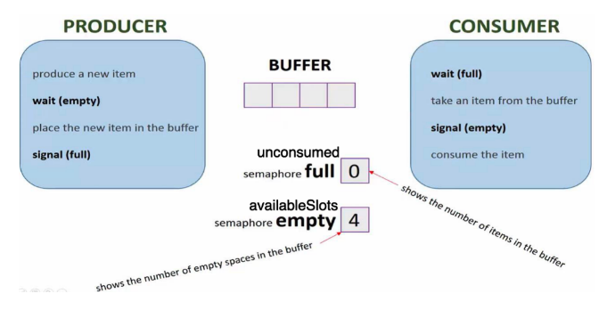

# Assignment #4 - Real-time crypto brokerage

*CS 480 S1, Spring 2023* - *Anthony Norderhaug*, *Anthony Contreras*

Due on **4/20/23 at 4:00 PM**, start of class

## Overview

Simulate a cryptoexchange brokerage that connects *producers* with *consumers* via a *bounded buffer*. Parties will <u>vary amongst each other</u> by their **processing rate** and **allowed amount** on the buffer. These attributes will <u>affect the order of request execution</u>, all which will be logged with the provided output methods and compared with specific testcases to ensure proper *semaphore*, *thead*, and mutex *implementation*.

## Process

1. Grab command-line args
   
   1. EX: *Production limit,* *processing times*

2. Start 2 *producer* threads and 2 *consumer* threads
   
   1. ORDER: Bitcoin (p), Ethereum (p), Blockchain X (c), Blockchain Y (c)
   
   

3. Threads will place onto & pull from *requests* via a **buffer**
   
   1. FIFO, so most likely *queue*
   
   2. To ensure synchonrization, utilize a *mutex* to ensure only 1 party is accessing at a time
   
   3. <u>All parties will vary amongst each other</u> via **processing time** & **limited presence** parameters

4. End conditions...
   
   1. *Producers* run until <u>production limit reached</u>
   
   2. *Consumers* run until <u>production limit reached</u> AND <u>buffer is empty</u>

5. Everyime the *buffer* is modified, the buffer's state & modifying thread should be outputted via the provided **log.c**, **log.h** files
   
   1. Compared w/ GradeScope's *request* execution order to ensure proper IPC implementation

6. Returning to the main thread...
   
   1. *Consumer* threads will wait for the queue to fill before completing requests
      
      1. With 2 seperate consumers, the production limit being reached will result in <u>1 perpetually waiting for a "request that's not coming"</u> and be blocked
   
   2. In this case, the *main* thread will implement a **barrier** via a semaphore
      
      1. *Consumer* threads will have access to this *barrier* and "unlock it" upon its *end condition* being reached (stated earlier)
      
      2. Upon so, *main* will continue executing
         
         1. Due to being a *parent thread*, *main* is <u>capable of ending its children thread directly</u> or <u>having the OS end them itself upon completion</u>

## Tasks

- [ ] Getopt parsing for command-line args

- [ ] Producer implementation w/ parameters for varying party attributes

- [ ] Consumer implementation w/ parameters for varying party attributes

- [ ] Buffer implementation, utilziing mutex and provided output methods

- [ ] Semaphores for buffer's empty spaces and current requests

- [ ] Bitcoin semaphore

- [ ] Barrier implementation within main

- [ ] Main thread progression, properly initializing threads
